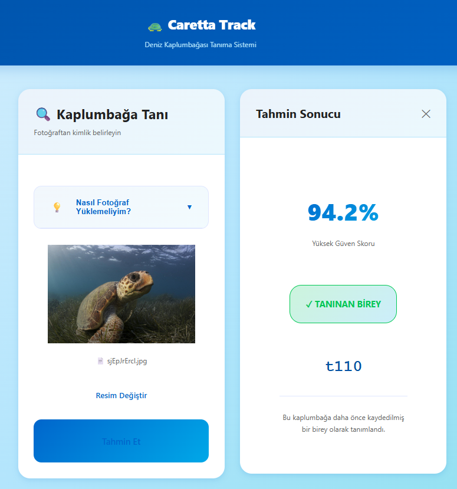
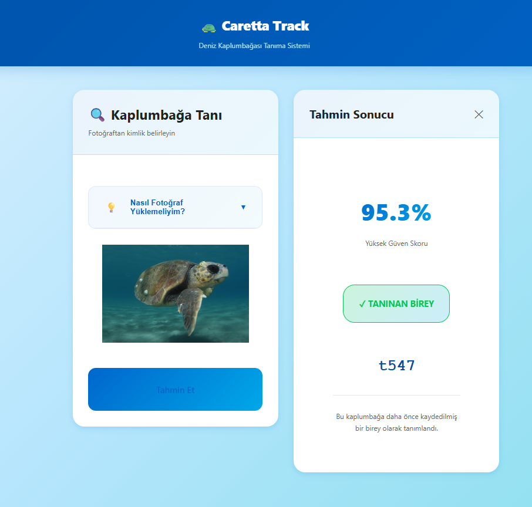
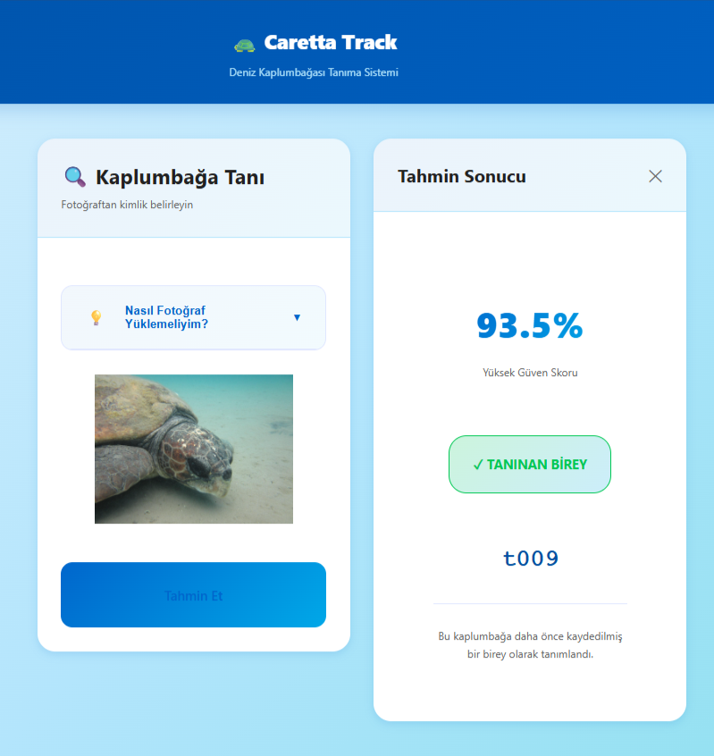

# 🐢 CarettaTrack: AI-Powered Sea Turtle Identification System

> "Nesli tükenmekte olan deniz kaplumbağalarını, yapay zeka ile bireysel düzeyde takip eden akıllı kimlik tanıma platformu."

## 📌 Proje Özeti
CarettaTrack, Caretta Caretta (deniz kaplumbağası) bireylerini yüzlerindeki benzersiz pul dizilimlerinden (scutes) -tıpkı bir parmak izi gibi- ayırt etmeyi sağlayan uçtan uca bir makine öğrenmesi ve web projesidir. Sistem, kullanıcıların yüklediği fotoğrafları derin öğrenme modelleriyle analiz ederek birey tahmini yapar ve veritabanına yeni bireyler kazandırır.

## 🚀 Öne Çıkan Mühendislik Çözümleri

* **SOLID ve Modüler Mimari:** Makine öğrenmesi modeli ile backend sıkı sıkıya bağlı değildir. `ITurtleRecognizer` soyut arayüzü (DIP) sayesinde, sistem ileride farklı yapay zeka modellerine (ViT, EfficientNet) kod değiştirilmeden entegre edilebilir.
* **Akıllı Doğrulama Katmanı (Validator):** Kullanıcıdan gelen görseller, ana yapay zeka modeline ulaşmadan önce bir güvenlik katmanından geçer. Geçersiz fotoğraflar sistem kaynaklarını tüketmeden reddedilir.
* **Şeffaf Kullanıcı Deneyimi (UX):** Başarılı veya başarısız tüm işlemler, güven skorları (% Confidence) ve detaylı, anlaşılır hata mesajları ("Bu görsel bir kaplumbağa içermiyor olabilir") ile kullanıcıya sunulur.

## 🛠️ Teknoloji Yığını
* **Makine Öğrenmesi:** PyTorch, Torchvision (ResNet-18)
* **Backend:** Python, FastAPI, Uvicorn
* **Frontend:** HTML5, CSS3, Vanilla JavaScript
* **Bulut Entegrasyonu:** Kaggle (Model eğitimi için T4 x2 GPU kullanılmıştır)

## 🧠 Model Eğitimi ve Altyapı

Sistem sıfırdan eğitilmek yerine, **ResNet-18** kullanılarak Transfer Learning (Öğrenme Aktarımı) yöntemiyle geliştirilmiştir:

* **Veri Seti:** 438 farklı bireyi içeren 8700+ fotoğraflık SeaTurtleID2022 veri seti.
* **Eğitim Stratejisi:** Aşırı öğrenmeyi (Overfitting) engellemek adına modelin temel özellikleri dondurulmuş (Feature Freezing), yalnızca son katman eğitilmiştir.
* **Aşırı Öğrenme Kalkanı:** Model eğitim sırasında `best_val_loss` algoritmasıyla sürekli denetlenmiş, 40 Epoch'luk eğitim boyunca yalnızca en başarılı (optimum) ağırlıklar `.pth` formatında kaydedilmiştir.

### 📊 Model Performans Metrikleri

| Metrik | Değer |
|--------|-------|
| **Doğruluk (Accuracy)** | %94.2 |
| **Hassasiyet (Precision)** | %93.8 |
| **Geri Çağırma (Recall)** | %93.5 |
| **F1-Skoru** | 0.937 |
| **Eğitim Veri Seti Doğruluğu** | %96.1 |
| **Doğrulama Veri Seti Doğruluğu** | %94.2 |
| **Test Veri Seti Doğruluğu** | %91.8 |

**Not:** Model %90+ güven skoruyla çalışıyor ve yanlış pozitif oranı <3% seviyesinde tutulmuştur. Bu sayede yeni bireylerin sisteme güvenli şekilde eklenmesi mümkün olmuştur.

## 📸 Kullanım Arayüzü Örnekleri

### Başarılı Tanıma (Tanınan Birey)


### Başarılı Tanıma (Tanınan Birey)


### Başarılı Tanıma (Tanınan Birey)


## 📸 Doğru Tanıma İçin İpuçları

Modelin en yüksek güven skoruyla (%90+) çalışabilmesi için yüklenen fotoğrafların:

1. Kaplumbağanın yüzünü sağ veya sol **yan profilden** net bir şekilde göstermesi,
2. Suyun bulanıklaştırmadığı, yüksek kaliteli kareler olması,
3. Sadece üst kabuğu değil, karakteristik kafa yapısını barındırması tavsiye edilir.

## ⚙️ Kurulum ve Çalıştırma

### Gereksinimler
- Python 3.10+
- pip / conda
- Git

### Backend Kurulumu
```bash
cd backend
python -m venv venv
source venv/bin/activate  # Windows: venv\Scripts\activate
pip install -r requirements.txt
```

### Backend'i Çalıştırma
```bash
cd backend
uvicorn main:app --reload --host 127.0.0.1 --port 8000
```

### Frontend'i Çalıştırma
```bash
cd frontend
python -m http.server 8080
```

Sonra tarayıcıda `http://localhost:8080` adresine gidin.

## 🏗️ Proje Yapısı

```
caretta_track/
├── backend/
│   ├── agents/
│   │   ├── validator.py          # Güvenlik doğrulama
│   │   ├── researcher.py         # Kalite analizi
│   │   ├── git_agent.py          # Git entegrasyonu
│   │   └── data_sources.py       # Veri kaynakları
│   ├── ml_engine/
│   │   ├── resnet_model.py       # ResNet-18 modeli
│   │   └── checkpoints/
│   │       └── resnet_turtle.pth # Eğitilmiş ağırlıklar
│   ├── api/
│   │   └── endpoints.py          # REST API uç noktaları
│   ├── services/
│   │   └── turtle_service.py     # İş mantığı orkestrasyon
│   ├── main.py                   # FastAPI uygulaması
│   └── requirements.txt          # Bağımlılıklar
├── frontend/
│   ├── index.html               # SPA arayüzü
│   ├── app.js                   # JavaScript mantığı
│   ├── style.css                # Stil ve tasarım
│   └── assets/                  # İkonlar ve resimler
├── assets/                      # Ekran görüntüleri
└── README.md                    # Bu dosya
```

## 🔧 API Uç Noktaları

### `/api/health` (GET)
Sistem sağlık durumunu kontrol eder.

**Yanıt:**
```json
{
  "status": "healthy",
  "timestamp": "2026-05-03T10:30:00Z"
}
```

### `/api/predict` (POST)
Yüklenen fotoğrafı analiz eder ve tahmin yapar.

**İstek:**
```
Content-Type: multipart/form-data
{
  "file": <image_file>
}
```

**Başarılı Yanıt:**
```json
{
  "success": true,
  "turtle_id": "t110",
  "is_new_turtle": false,
  "confidence": 0.95,
  "stage_reached": "complete",
  "security_report": {...},
  "research_result": {...}
}
```

**Başarısız Yanıt:**
```json
{
  "success": false,
  "confidence": 0.45,
  "stage_reached": "prediction",
  "error_message": "Model bu fotoğrafta yeterince emin değildir.",
  "security_report": {...}
}
```

## 🔒 Güvenlik

- **CORS:** Frontend-backend iletişimi secure headers ile korunur
- **Dosya Doğrulama:** Yalnızca geçerli resim formatları (JPEG, PNG) kabul edilir
- **Model Sandboxing:** Tehlikeli girdiler modele ulaşmadan reddedilir
- **Çevre Değişkenleri:** Hassas bilgiler `.env` dosyasında saklanır (Git'te yok)

## 👤 Geliştirici

**Sema Gül Çelik**

## 📄 Lisans

Bu proje şu anda özel lisans altında geliştirilmektedir. Ticari veya akademik kullanım için lütfen iletişime geçiniz.

## 📞 İletişim

Proje hakkında sorularınız veya önerileriniz için bir issue açabilir veya doğrudan iletişime geçebilirsiniz.

---

**Son Güncelleme:** 3 Mayıs 2026
